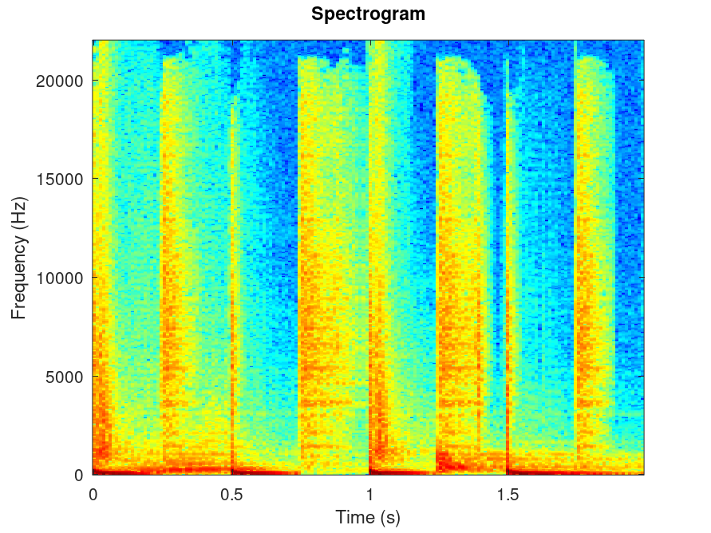
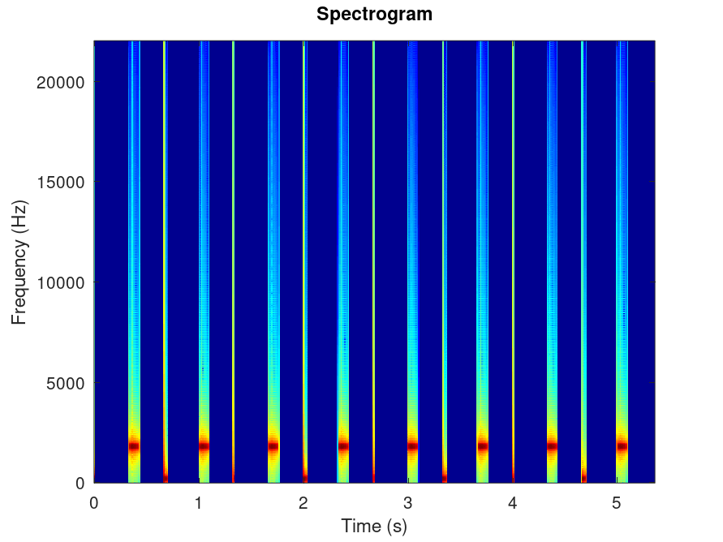
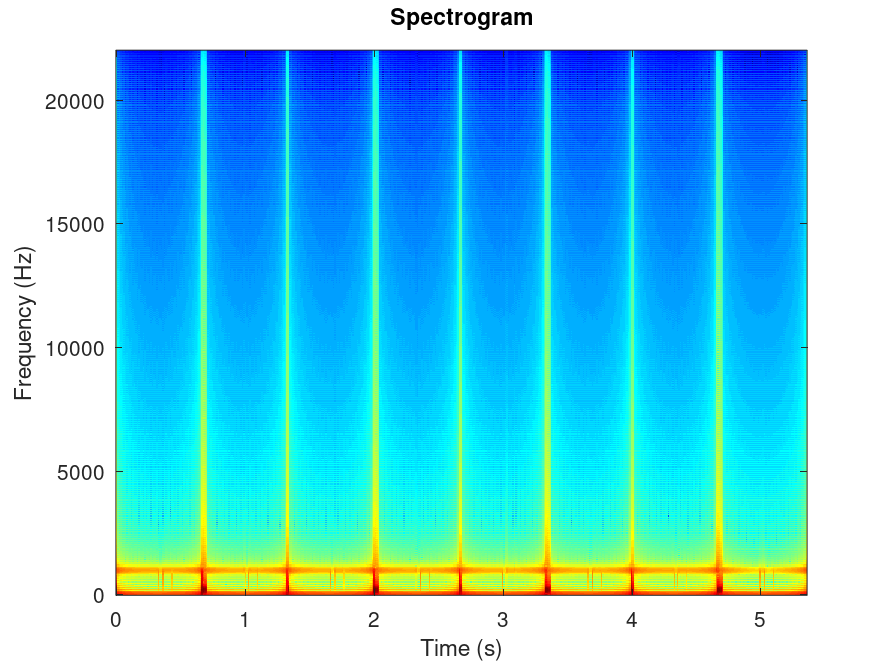
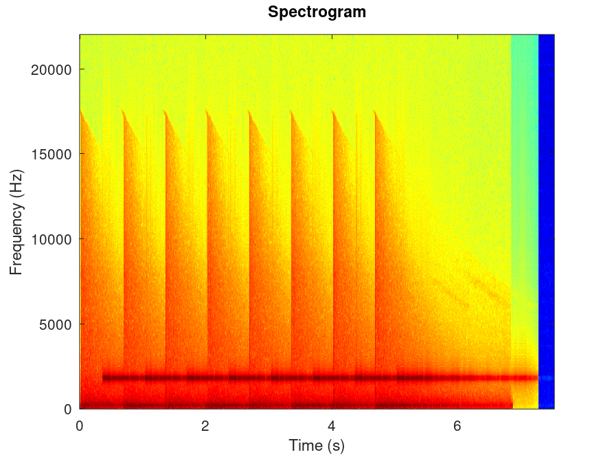

# Task 1

## Stereo to Mono
The conversion from stereo to mono is done as follows
Each element i in the mono vector is the average of the corresponding elements in the signal matrix, normalizing the result at the end. Normalizing ensures that the amplitude of the audio signal is adjusted to a standard level.

## Spectogram
The spectrogram matrix is a two-dimensional matrix where each row represents a frequency and each column represents a time. The value at position (i, j) in the matrix represents the amplitude of the frequency i at time j.

The frequency vector is a column vector that contains all the frequencies present in the signal.

The time vector is a column vector that contains all the timestamps at which the Short-Time Fourier Transform (STFT) was computed.

To generate the spectogram of a a given signal we will do as follows:

1. Get the size of the signal and compute the number of windows using the floor function.
2. For each window:
Apply the Hann function to it. Compute the Fourier Transform of the window with a resolution twice the size of the window. Discard the conjugate part of the Fourier Transform. Store the result in the spectrogram matrix.
3. Compute the frequency vector. Remember that the Fourier Transform is symmetric, so you only need the first half. Consider what frequencies the Discrete Fourier Transform (DFT) can represent.
4. Compute the time vector. The time between each window is the size of the window divided by the sampling rate. It starts from 0.

This process allows us to analyze the frequency content of a signal as it changes over time, providing a comprehensive view of the signal’s characteristics.

Here are some example spectograms generated:

## Oscilator
The `oscillator` function is a powerful tool for generating sine waves. It accepts four parameters: the frequency of the sine wave, the duration of the sound to be created, the sampling rate, and the envelope. The function returns the generated sine wave as a column vector.

### Steps to Create the Sine Wave
1. **Time Vector**: Create a time vector `t` that ranges from 0 to the specified duration. The step size should be `1/sampling_rate`. This time vector is used to generate the sine wave.
2. **Sine Wave Generation**: This will produce a sine wave at the specified frequency.

### Envelope Creation

The envelope is created based on the parameters of attack, decay, sustain, and release (ADSR). The number of samples for each ADSR component is computed using the envelope parameters and the sampling rate. The `floor` function is used to ensure that the number of samples is an integer.

1. **Attack Envelope**: A linear ramp from 0 to 1 over the attack samples.
2. **Decay Envelope**: A linear ramp from 1 to the sustain level.
3. **Sustain Envelope**: A constant value equal to the sustain level.
4. **Release Envelope**: A linear ramp from the sustain level to 0 over the release samples.

The final envelope is created by concatenating the attack, decay, sustain, and release envelopes.
The sine wave is then multiplied by the envelope to apply amplitude modulation (Hadamard product).

## Low Pass Filter

The `low_pass` accepts three parameters: a signal `x`, a sampling rate `fs`, and a cutoff frequency `fc`. The function returns the filtered signal as a column vector. Here's a step-by-step breakdown of how it works:

1. **Fourier Transform**: The function first computes the Fourier Transform of the signal `x`. This mathematical technique transforms the signal from its original domain to a representation in the frequency domain.

2. **Frequency Computation**: Next, the function computes all possible frequencies of the signal. This is similar to the process used in the spectrogram function.

3. **Vector Mask Creation**: A vector mask is created. This mask is 1 for frequencies lower than the cutoff frequency `fc`, and 0 for frequencies higher than `fc`.

4. **Hadamard Product**: The function then applies the Hadamard product between the Fourier Transform of the signal and the mask. The Hadamard product, also known as the element-wise or Schur product, is a binary operation that takes two matrices of the same dimensions and produces another matrix of the same dimension as the operands where each element `i, j` is the product of elements `i, j` of the original two matrices.

5. **Inverse Fourier Transform**: The function computes the inverse Fourier Transform to get the filtered signal. This process transforms the signal back from the frequency domain to its original domain.

6. **Normalization**: Finally, the filtered signal is normalized to ensure that it maintains a consistent scale.

## Reverb

Sure, here's a README paragraph based on the provided information:

The `apply_reverb` takes two parameters: the `signal` and the `impulse response`. The purpose of this function is to apply the impulse response to the signal, thereby creating a reverberation effect.

Before using `apply_reverb`, it's important to ensure that the impulse response is in mono format. Once the impulse response is in the correct format, the next step is to compute the convolution between the signal and the impulse response.

Finally, the resulting signal is normalized to ensure that the amplitude of the output signal is within a suitable range. This step is crucial to prevent any potential distortion or clipping in the output audio. The `apply_reverb` function then returns the signal with the applied reverb, ready for further processing or output. 

This function provides a simple and effective way to add depth and richness to any audio signal, making it an essential tool for audio engineers and music producers.

# Task 2

## Parse Data

This function reads numbers from a file with a specific format. The filename is provided as an input. The file structure is as follows:

- The first line contains a natural number, **n**.
- The second line contains **n+1** integers. These represent the abscissas of the interpolation support points
- The third line also contains **n+1** integers. These represent the ordinates of the corresponding points.

The function processes this data and returns two column vectors, **x** and **y**, which contain the abscissas and ordinates of the interpolation support points, respectively. This function is particularly useful for numerical analysis tasks, such as polynomial interpolation or curve fitting.

## Splice C2

This function is designed to solve a matrix equation system. The function returns a column vector.

## P Spline

This function is designed to work with a previously determined matrix of coefficients and a column vector `x`. This function calculates the values of the spline polynomial at the points specified in `x_interp` and returns these values in the `y_interp` vector. This function is useful for tasks such as data interpolation and curve fitting.

## Vandermonde

This function is designed to solve a system of matrix equations. It takes as input two column vectors. These vectors represent the parameters of the system. The function processes these inputs and returns the column vector which contains the coefficients that solve the system.

## P Vandermonde
This function is designed to evaluate the values of a **Vandermonde polynomial** at specified points. It takes in two primary arguments: `coef`, a vector of coefficients that has been previously determined, and `x_interp`, an abscissa vector where the polynomial values are to be computed. The function processes these inputs and calculates the corresponding polynomial values. The output of the function is `y_interp`, a column vector that contains the evaluated values of the Vandermonde polynomial at the points specified in `x_interp`. This function is particularly useful in numerical analysis and interpolation methods where polynomial evaluations are required.

# Task 3

## Preprocessing
The `preprocess` function accepts two parameters: a matrix `A` and an integer `min_count`. The matrix `A` represents our raw data, where each row corresponds to a client and each column corresponds to a review. The integer `min_count` is a threshold value that determines the minimum number of reviews a client must have given. The function operates by iterating through the matrix and removing any clients (rows) that have given strictly fewer than `min_count` reviews. This helps to ensure that our subsequent analyses are based on clients who have provided a sufficient amount of feedback.

## Cosine Similarity
The `cosine_similarity` accepts two input parameters, both of which are column vectors. The function first normalizes these vectors to ensure they are on a common scale. Following this, it computes the cosine similarity between the normalized vectors. The cosine similarity is a measure that calculates the cosine of the angle between these vectors. This value ranges from -1 to 1, indicating the degree of similarity between the two vectors. A value of 1 means the vectors are identical, 0 means they are orthogonal (no similarity), and -1 means they are diametrically opposed.

## Recomandations
The `recommendations` function takes in several parameters: the path to a `.csv` file, the index of a theme that the user likes, the number of themes to recommend, and the number of singular values to retain in the Singular Value Decomposition (SVD) process.

1. The function begins by loading a matrix from the specified `.csv` file.
2. The loaded matrix is then preprocessed.
3. The function then computes the reduced SVD of the preprocessed matrix.
4. The resulting `V` matrix contains information about the themes. The function sorts the themes based on their similarity with the liked theme.
5. Finally, the function returns the indices of the recommended themes.

This function provides a streamlined and efficient way to generate theme recommendations based on user preferences. It leverages the power of SVD and cosine similarity to ensure that the recommendations are relevant and personalized.